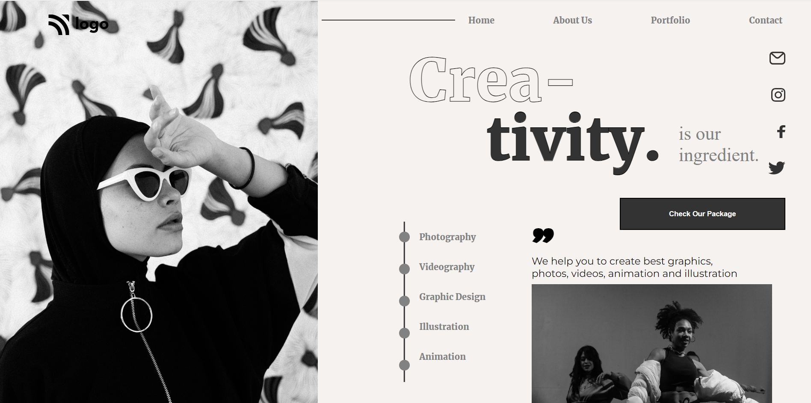

# Project 14 - HTML and CSS

By Piyush Bhatt

Deployed link of website &nbsp; 

 

# [Link to Project 14](https://dance-homepage-pi.vercel.app/)

 

# Preview of the Project.

 

## What I learnt in this Project?

- I learned about how to make website **layout** through **flexbox.**
- I learnt to give **stroke** to the text.
- I learnt more about **flex column** and other flex properties.
- I learnt to create **line and circle** and place them on top of each other.
- I also learn to create **stylish double quotes**.

  

# Time Taken to complete  this project is 10 hour.